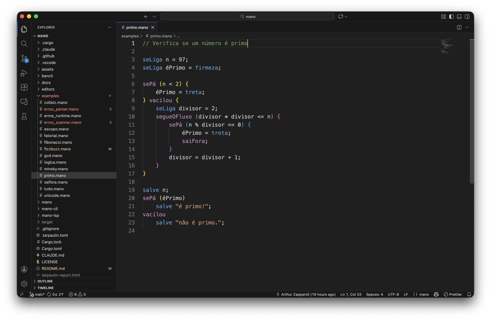
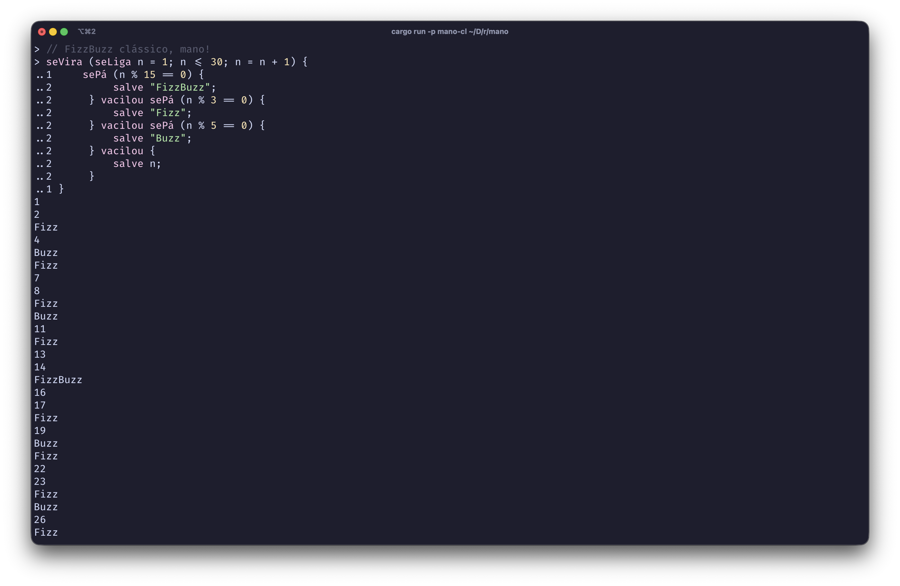
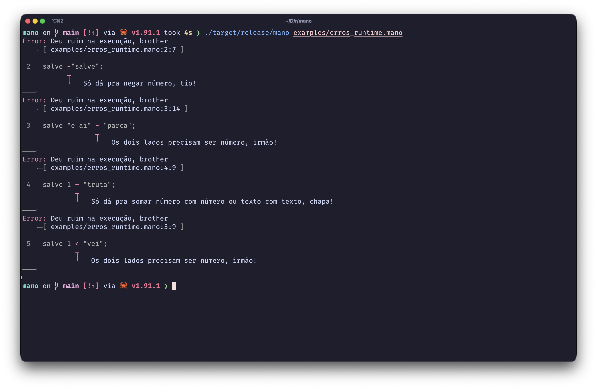
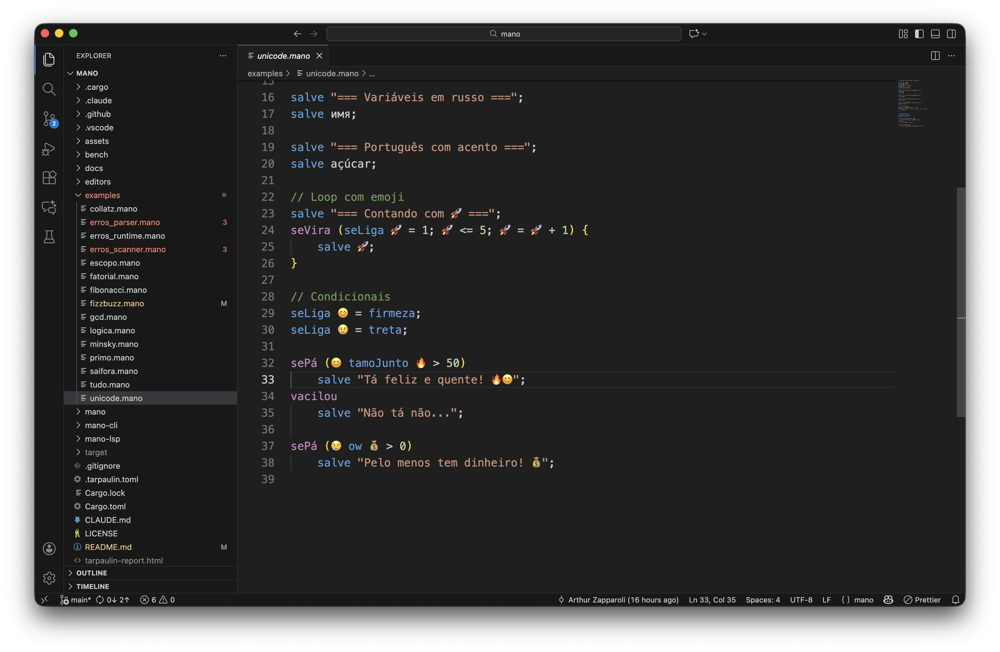
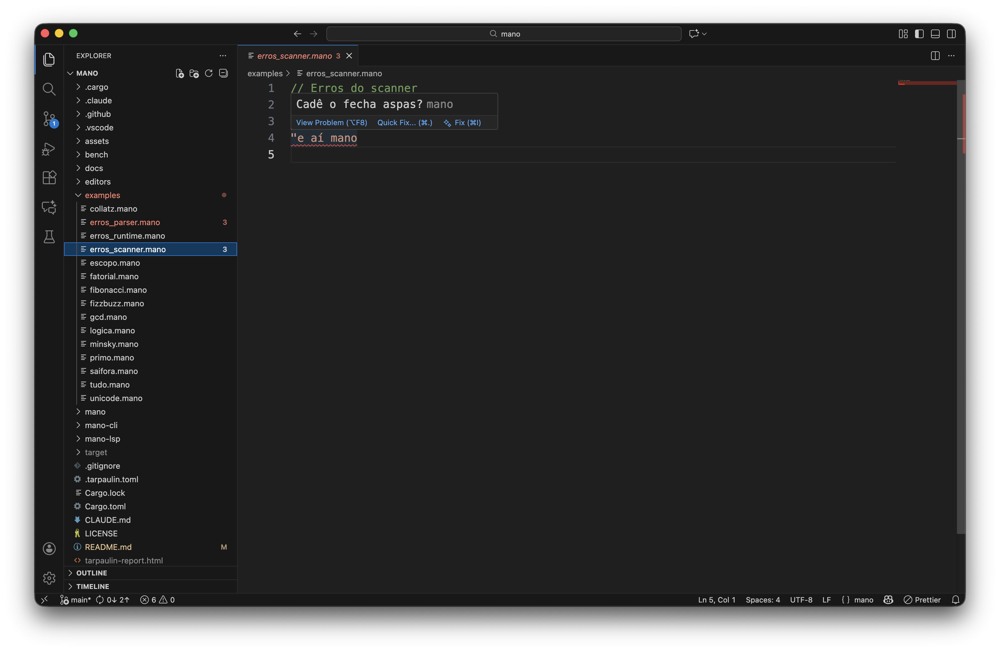
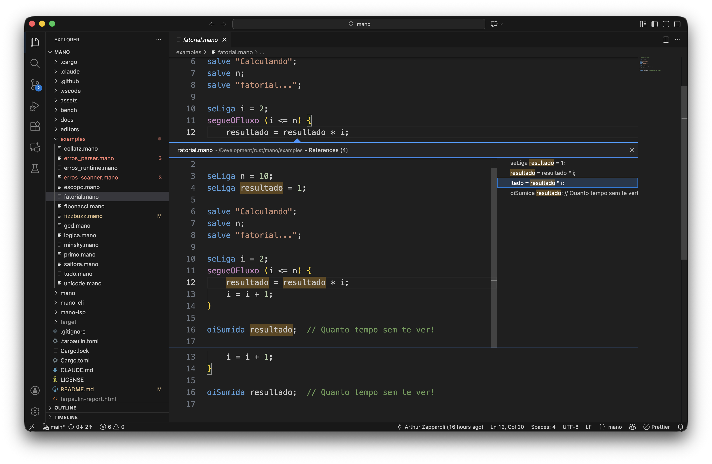
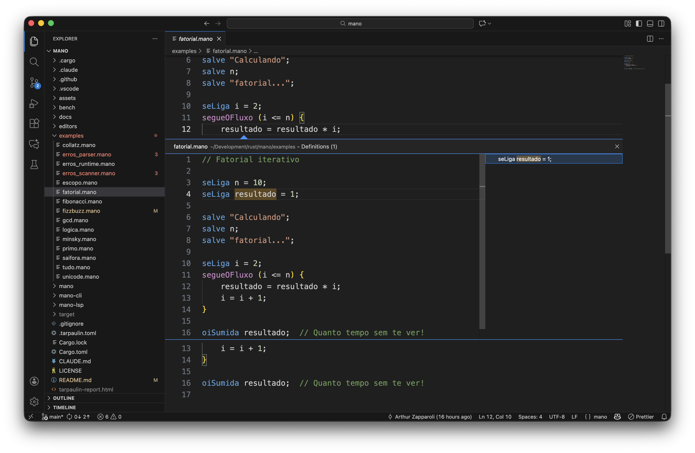
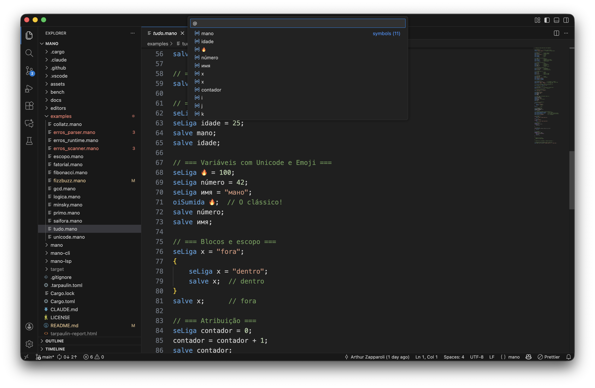

# mano 🔥

[](https://codecov.io/github/arthurgeek/mano)

A tree-walking interpreter implemented in Rust, following the [Crafting Interpreters](https://craftinginterpreters.com/) book. All keywords use São Paulo "mano" slang, and error messages roast you.

**This project exists to learn about interpreters, language design, LSPs, and Rust.** It's not meant for production use — it's meant for learning and having fun along the way.

Built with [Claude Code](https://claude.ai/code) — I designed and directed while Claude helped implement. Part of the learning was exploring AI-assisted development.

## Features

- Full lexer, parser, and tree-walking interpreter
- Brazilian Portuguese keywords with cultural flavor
- REPL with syntax highlighting and auto-complete
- Language Server Protocol (LSP) with diagnostics and completions
- VS Code extension with syntax highlighting and LSP integration
- Beautiful error messages using [ariadne](https://github.com/zesterer/ariadne)
- Unicode identifiers (including emoji! `seLiga 🔥 = 100`)
- [Turing complete](examples/minsky.mano) (proven via Minsky machine simulation)


*Prime number checker showcasing keywords, control flow, and the `%` operator*

## Example

```
seLiga nome = "Arthur";
salve "E aí, " + nome + "!";

sePá (firmeza) {
    salve "Tá firmeza, mano!";
} vacilou {
    salve "Deu treta...";
}

// FizzBuzz clássico!
seVira (seLiga n = 1; n <= 15; n = n + 1) {
    sePá (n % 15 == 0) salve "FizzBuzz";
    vacilou sePá (n % 3 == 0) salve "Fizz";
    vacilou sePá (n % 5 == 0) salve "Buzz";
    vacilou salve n;
}

// Emoji variables porque sim
seLiga 🔥 = "crush";
oiSumida 🔥;
```


*REPL with syntax highlighting, multi-line editing, and FizzBuzz output*


*Errors roast you in mano style with precise source locations*


*Full Unicode support: emoji and international characters as variable names*

## Keywords

| Lox | mano | Meaning | Status |
|-----|------|---------|--------|
| `print` | `salve` | "hey!" | ✅ |
| `print` | `oiSumida` | "hey stranger!" (alias) | ✅ |
| `var` | `seLiga` | "pay attention" | ✅ |
| `true` | `firmeza` | "solid/legit" | ✅ |
| `false` | `treta` | "drama/trouble" | ✅ |
| `nil` | `nadaNão` | "nothing at all" | ✅ |
| `if` | `sePá` | "maybe/perhaps" | ✅ |
| `else` | `vacilou` | "you messed up" | ✅ |
| `and` | `tamoJunto` | "we're together" | ✅ |
| `or` | `ow` | interjection | ✅ |
| `while` | `segueOFluxo` | "follow the flow" | ✅ |
| `for` | `seVira` | "figure it out" | ✅ |
| `break` | `saiFora` | "get out" | ✅ |
| `fun` | `olhaEssaFita` | "check out this story" | ✅ |
| `return` | `toma` | "take it!" | ✅ |
| `class` | `bagulho` | "thing/stuff" | 🔜 |
| `this` | `oCara` | "the dude" | 🔜 |
| `super` | `mestre` | "master" | 🔜 |

## Usage

```bash
# REPL mode
cargo run -p mano-cli

# Run a script
cargo run -p mano-cli -- script.mano
```

## LSP Support

The `mano-lsp` crate implements the [Language Server Protocol](https://microsoft.github.io/language-server-protocol/), providing editor-agnostic tooling. This was built to learn how LSPs work!

**Features:**
- Real-time diagnostics (scan and parse errors)
- Auto-completion (keywords and variables)
- Go to definition / Find references
- Rename symbol
- Document symbols
- Hover information
- Code folding

**VS Code Extension** (`editors/vscode`):
- Syntax highlighting (TextMate grammar)
- Bracket matching and auto-closing
- Code folding and region markers
- Smart indentation and comment continuation
- Unicode/emoji word selection
- LSP client integration


*Real-time diagnostics catch errors as you type*


*Find all references to any variable*


*Jump to definition with a single click*


*Document symbols for quick navigation*

```bash
# Build LSP and install extension
cargo build --release -p mano-lsp
ln -s $(pwd)/editors/vscode ~/.vscode/extensions/mano.mano-lang-0.1.0
```

## Differences from Lox

mano implements several [Crafting Interpreters challenges](https://craftinginterpreters.com/contents.html) and extensions:

| Feature | Description |
|---------|-------------|
| `%` modulo | Arithmetic remainder operator |
| `? :` ternary | Conditional expressions |
| `,` comma | Expression sequencing (returns rightmost) |
| `/* */` nested | Block comments can nest |
| `saiFora` break | Exit loops early |
| Lambda expressions | Anonymous functions: `olhaEssaFita (x) { toma x * 2; }` |
| Unicode identifiers | Including emoji: `seLiga 🔥 = 42` |
| `oiSumida` alias | Second print keyword for variety |
| Source spans | All tokens/AST nodes track position for errors and LSP |
| Rich errors | Beautiful diagnostics with [ariadne](https://github.com/zesterer/ariadne) |
| REPL | Syntax highlighting, auto-complete, multi-line editing, history |

## Development

```bash
cargo test      # Run tests
cargo clippy    # Lint
cargo fmt       # Format
```

## Benchmarks (just for fun 😂)

We raced against Node.js. Spoiler: tree-walking interpreter vs V8 JIT goes exactly how you'd expect... eventually.

| Benchmark | mano | Node | Winner |
|-----------|------|------|--------|
| Fibonacci(35) | ~0ms | 40ms | **mano** |
| Primes to 1000 | 7ms | 40ms | **mano** |
| Loop 10k | 9ms | 40ms | **mano** |
| Loop 100k | 47ms | 40ms | Node (barely) |
| Primes to 10k | 59ms | 48ms | Node (barely) |
| Loop 1M | 359ms | 43ms | **Node 8x** |

Plot twist: mano wins on small scripts because Node's JIT warmup (~40ms) is slower than our entire execution! We only lose when the workload is heavy enough for JIT to pay off.

**Conclusion**: If your script runs in under 40ms, just use mano. (Please don't actually do this.)

## License

MIT
